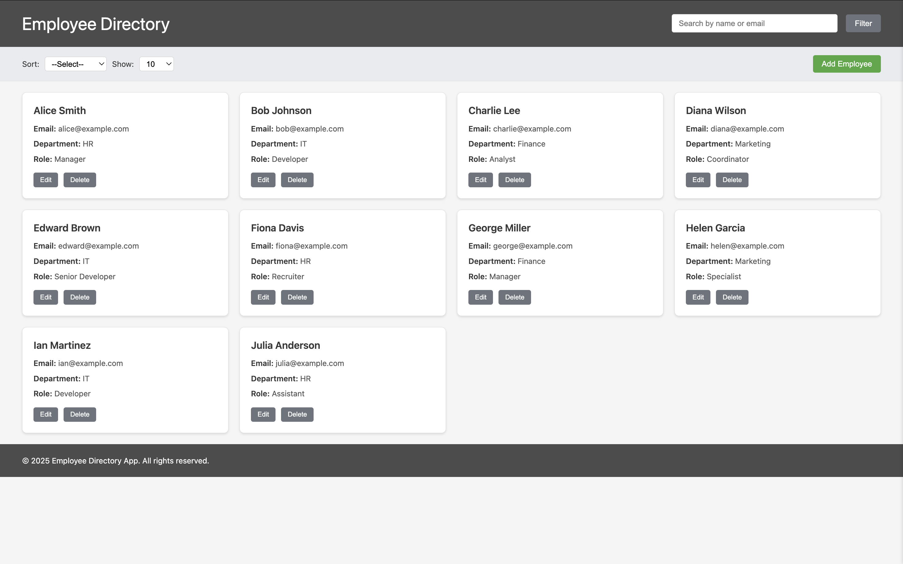
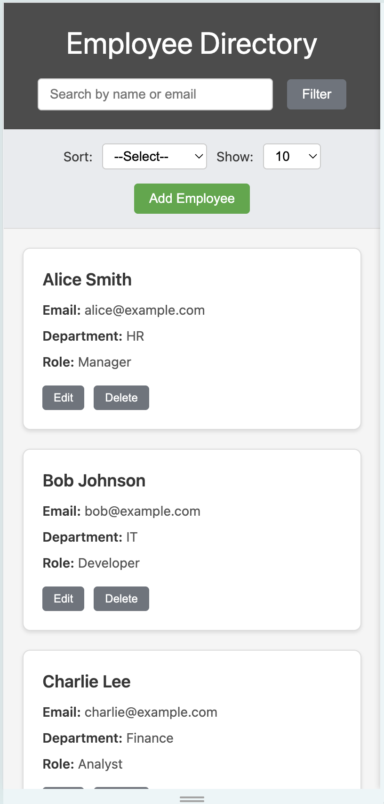
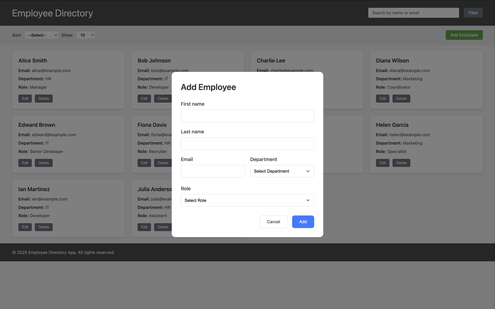
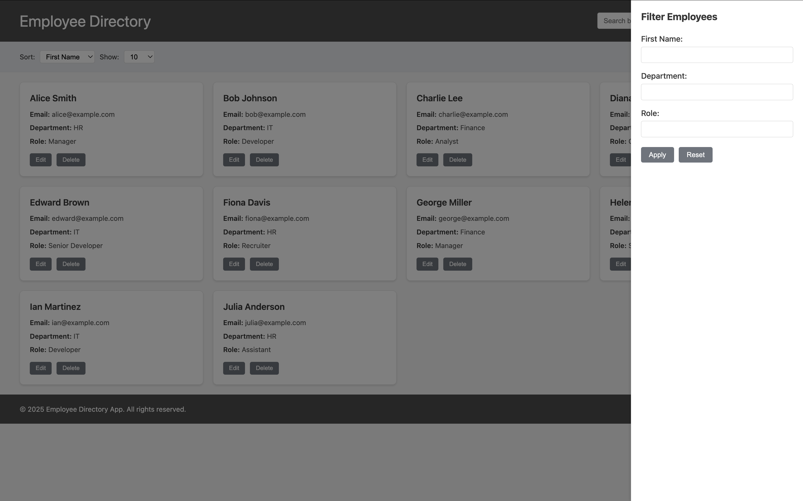

# 👥 Employee Directory

An interactive employee directory built using **HTML**, **CSS**, and **Vanilla JavaScript**, simulating backend data through mock JSON. The app provides features to search, filter, sort, and manage employee information via a modern, responsive UI.

---

## 📁 Project Structure

```
.
├── README.md
├── index.html                    # Main entry point
└── src
    └── static
        ├── css
        │   └── style.css         # All styles
        └── js
            ├── app.js           # App logic and rendering
            └── data.js          # Mock employee data
```

---

## 🔧 How to Clone & Run

### 🌀 Clone the Repository

```bash
git clone https://github.com/Vammshi2/AJACKUS-Assignment.git
cd AJACKUS-Assignment
```

### ▶️ Run the App

#### Option 1: Using VS Code Live Server

1. Open the folder in **Visual Studio Code**
2. Right-click on `index.html` → **Open with Live Server**
3. App will open in your browser at:
   ```
   http://127.0.0.1:5500/index.html
   ```

---

## 📱 Screenshots

### Desktop View - Employee List

*Main dashboard showing employee cards with search and filter options*

### Mobile View - Responsive Design

*Mobile-responsive layout with stacked employee cards*

### Add/Edit Employee Form

*Form for adding new employees or editing existing ones*

### Search and Filter

*Advanced search and filtering capabilities*

## 💡 Usage Guide

### Managing Employees

1. **View Employees**: All employees are displayed as cards on the main dashboard
2. **Add Employee**: Click "Add New Employee" button and fill out the form
3. **Edit Employee**: Click "Edit" button on any employee card
4. **Delete Employee**: Click "Delete" button and confirm the action

### Search and Filter

1. **Search**: Use the search bar to find employees by name or email
2. **Filter**: Click "Show Filters" to access department and role filters
3. **Sort**: Use the sort buttons to order by name or department
4. **Clear**: Use "Clear Filters" to reset all search and filter criteria

### Pagination

- Use the pagination controls at the bottom to navigate through pages
- Adjust items per page using the dropdown (10, 25, 50, 100 items)
- Page information shows current range and total employees


## 🚀 Features

- 🔍 Search by **Name** or **Email**
- 🎯 Filter by **First Name**, **Department**, **Role**
- 🔃 Sort by **First Name** or **Department**
- 📄 Pagination (10, 25, 50, 100 items)
- ➕ Add, Edit, Delete employee records
- 💻 Responsive UI for all screen sizes
- 🧪 Mock backend using JS arrays

---

## 🧩 Technologies Used

- HTML5
- CSS3
- JavaScript (ES6)
- Mock Data (JSON-like structure in JS)

---

## 👨‍💻 Author

**Vamshikrishna Thogaru**  
🎓 B.Tech CSE | VIT Chennai  
🌐 Passionate about Front-End Development, Data Analysis, and Building Real-World Projects

---

## 📬 Contact

- 📧 **Email**: t.vamshikrishna2@gmail.com  
- 🌐 **Portfolio**: [https://vamportfolio.netlify.app/](https://vamportfolio.netlify.app/)  
- 💬 **WhatsApp**: [+91 98483 66562](https://wa.me/919848366562)  
- 📱 **Phone**: +91 98483 66562
- 🐙 **GitHub**: [Vammshi2](https://github.com/Vammshi2)

